# Task 2 (Spring Boot REST API)

## Student Details
- *Name:* Bhavika Chaudhary
- *Student ID:* 73586

## Project Description

This project is a RESTful backend application developed using Java and Spring Boot.
The application provides a Products API that allows clients to perform full CRUD operations (Create, Read, Update, Delete) on products.

The project demonstrates:

- REST API principles

- Layered architecture (Controller, Service, Repository)

- Usage of Spring Data JPA

- Integration with H2 in-memory database

- API testing using Postman

## Technologies Used

- Java 17

- Spring Boot

- Spring Web

- Spring Data JPA

- H2 Database

- Maven

- Postman


## Project Structure

**Screenshot:**
<p align="left">
  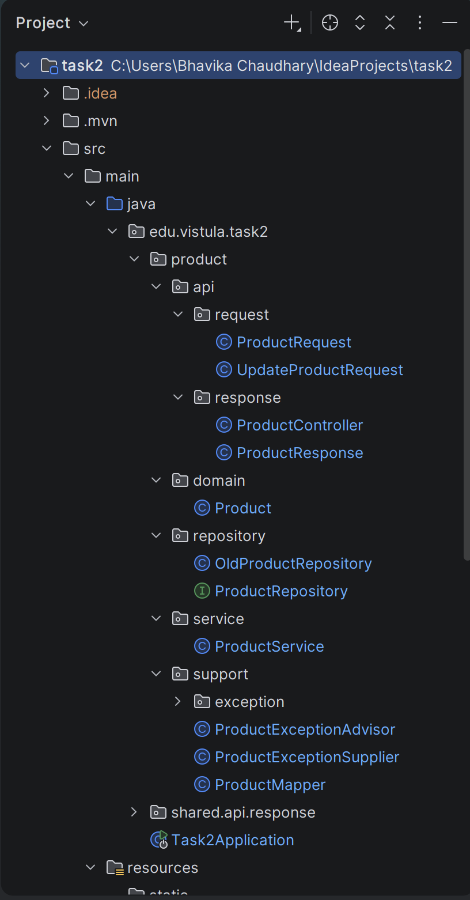
</p>

## Application Architecture

The application follows a layered architecture:

**1. Controller layer:**
Handles HTTP requests and responses.

**2. Service layer:**
Contains business logic and processing.

**3. Repository layer:**
Communicates with the database using Spring Data JPA.

**4. Domain layer:**
Represents database entities.

**5. Mapper layer:**
Converts between request, entity, and response objects.

## Database Configuration (H2)

1. The application uses the H2 database which exists only while the application is running.

- H2 Console: http://localhost:8080/console

2. Connection details:

- JDBC URL: jdbc:h2:mem:testdb

- Username: sa

- Password: (empty)


## API Endpoints & Use Cases
- **NOTE:** I already made some entities before clicking the upcoming screenshots.
- **Screenshot:** H2 Console with some random entities I created.
<p align="left">
  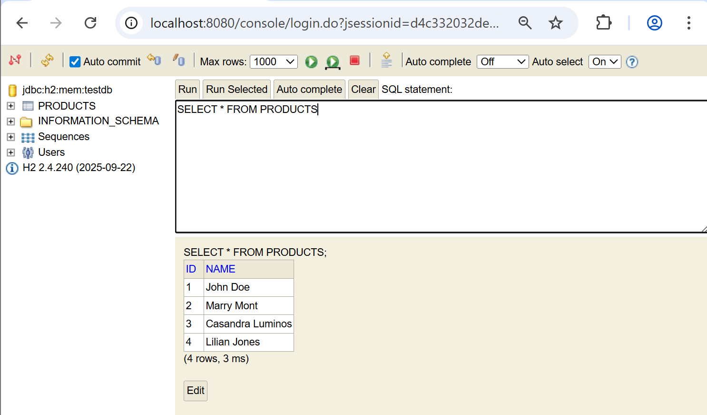
</p>

### CASE 1: Create Product (POST)

**Endpoint**
```
POST /api/v1/products
```

**Request Body**
```
{
"name": "Xarvis Thompson"
}
```

**Response**
```
{
"id": 5,
"name": "Xarvis Thompson"
}
```

**Screenshot:** Postman POST request
- **HTTP Status:** 201 Created
<p align="left">
  
</p>

### CASE 2: Get Product by ID (GET)

**Endpoint**
```
GET /api/v1/products/{id}
```

**Example**
```
GET /api/v1/products/3
```

**Response**
```
{
"id": 3,
"name": "Casandra Luminos"
}
```

**Screenshot:**
1. Postman GET by ID
- **HTTP Status:** 200 OK
<p align="left">
  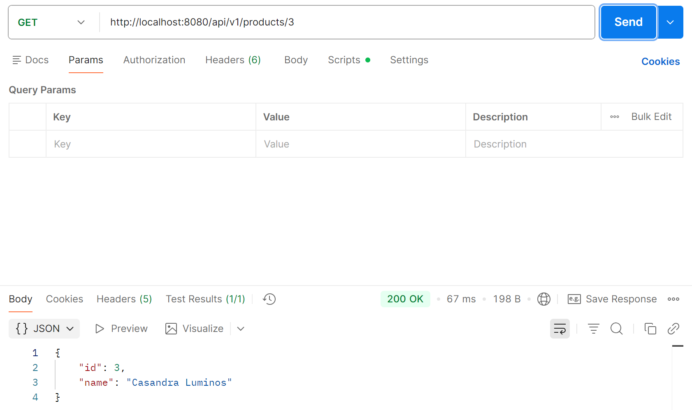
</p>

2. Postman GET by an ID that does not exist
- **HTTP Status:** 404 Not Found
<p align="left">
  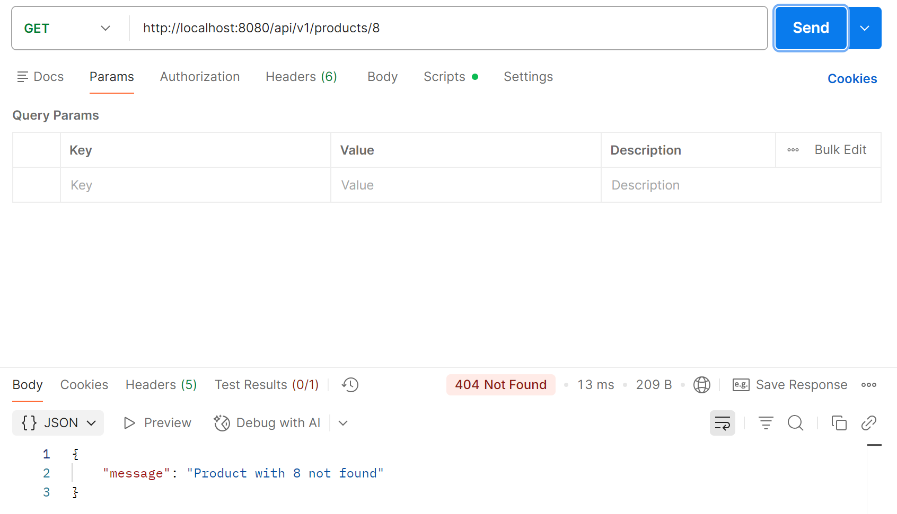
</p>

### CASE 3: Get All Products (GET)

**Endpoint**
```
GET /api/v1/products
```

**Response**
```
[
{
"id": 1,
"name": "John Doe"
},
{
"id": 2,
"name": "Marry Mont"
}
{
"id": 3,
"name": "Casandra Luminos"
}
{
"id": 4,
"name": "Lilian Jones"
}
{
"id": 5,
"name": "Xarvis Thompson"
}
]
```

**Screenshot:** Postman GET ALL

- **HTTP Status:** 200 OK
<p align="left">
  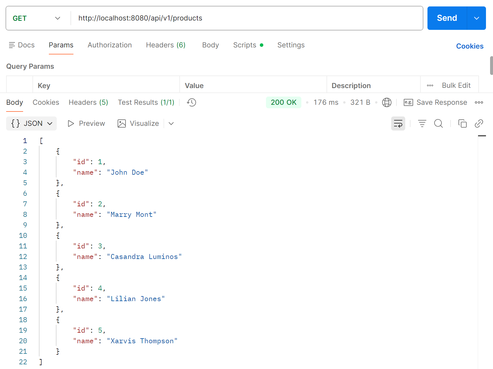
</p>

### CASE 4: Update Product (PUT)

**Endpoint**
```
PUT /api/v1/products/{id}
```

**Example**
```
PUT /api/v1/products/1
```

**Request Body**
```
{
"name": "Gaming Laptop"
}
```

**Response**
```
{
"id": 1,
"name": "Gaming Laptop"
}
```

**Screenshot:**
1. Postman PUT request
- **HTTP Status:** 200 OK
<p align="left">
  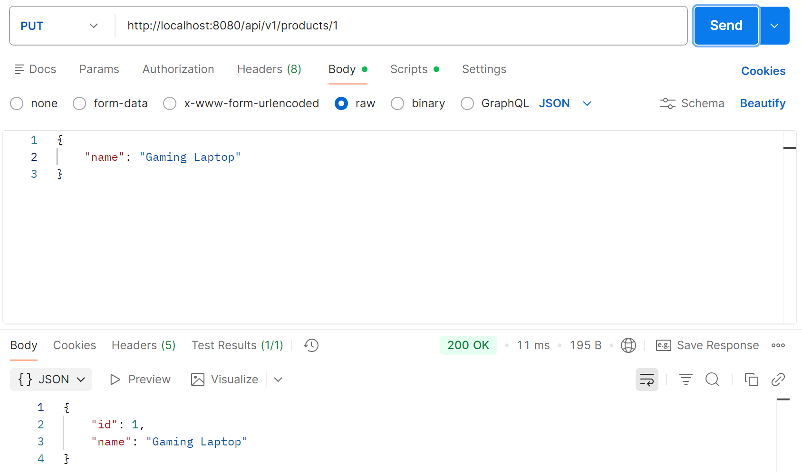
</p>

2. Postman PUT by an ID that does not exist
- **HTTP Status:** 404 Not Found
<p align="left">
  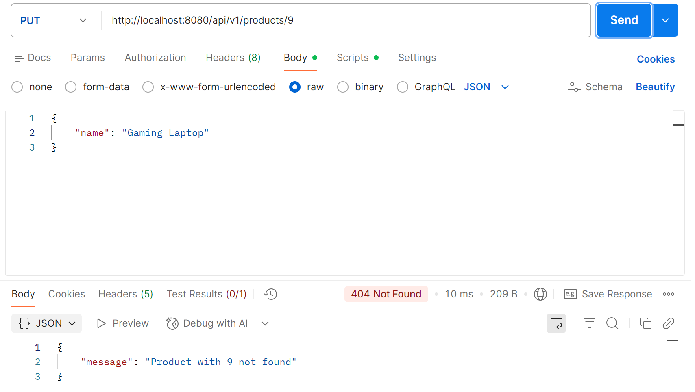
</p>

3. Postman GET after performing PUT
- **HTTP Status:** 404 Not Found
<p align="left">
  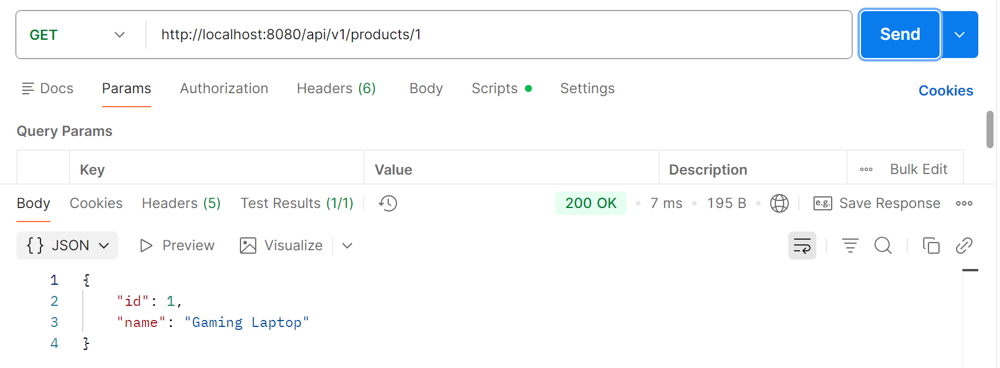
</p>

### CASE 5: Delete Product (DELETE)

**Endpoint**
```
DELETE /api/v1/products/{id}
```

**Example**
```
DELETE /api/v1/products/3
```

**Response**
```
No response body
```

**Screenshot:**
1. Postman DELETE request
- **HTTP Status:** 204 No Content
<p align="left">
  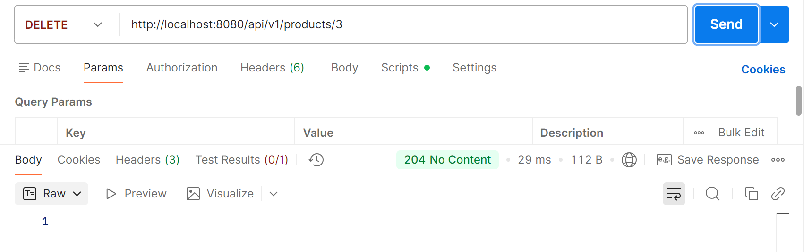
</p>

2. Postman DELETE by an ID that does not exist
- **HTTP Status:** 404 Not Found
<p align="left">
  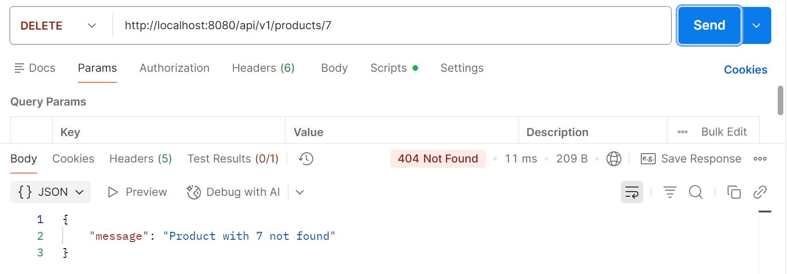
</p>

3. Postman GET after performing DELETE
- **HTTP Status:** 404 Not Found
<p align="left">
  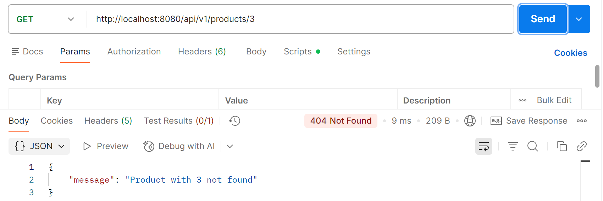
</p>

4. Postman GET all after performing DELETE
- **HTTP Status:** 200 OK
<p align="left">
  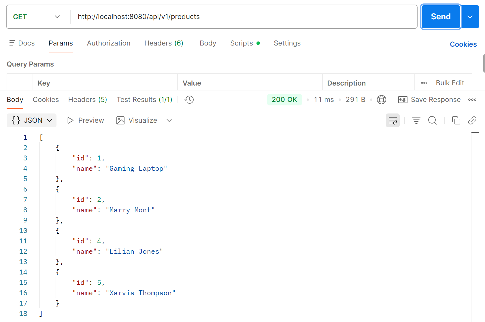
</p>

5. H2 Console output after performing all operations
<p align="left">
  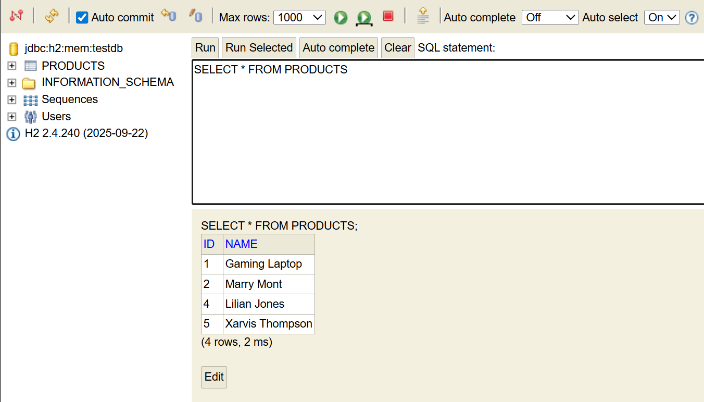
</p>

## API Testing

All endpoints were tested using Postman:

1. POST – create product

2. GET – retrieve product

3. GET ALL – list all products

4. PUT – update product

5. DELETE – remove product

The database state was verified using the H2 console.


## Conclusion

This project demonstrates:

- Correct usage of REST principles

- Proper Spring Boot project structure

- CRUD operations using Spring Data JPA

- Integration with H2 database

- API testing with Postman
